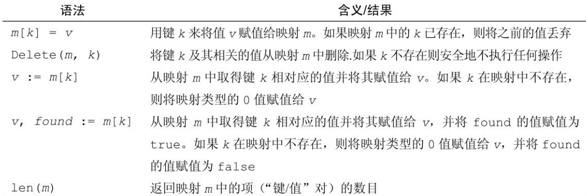

# 学习 go 的映射 map

!!! quote
		"Go is like a better C, from the guys that didn’t bring you C++." – Ikai Lan

## 映射(map)

本章介绍映射，在很多编程语言中都有类似的用来保存键值对(key-value)的数据结构，比如 python 中的 dict, c++ 中的 map。一般底层使用哈希
表或者红黑树来实现 map，查询效率是非常高的。如果你熟悉其他语言的 map 结构，上手 go 的 map 非常容易。

Go 也内置了 map 数据结构，作为 map 的 key，必须要是支持 == 和 != 操作符的类型，常用的基础类型 int, float64, string 等都是可以作为
map 的键的，但是像切片或者不能比较的结构体无法作为键。而映射的值没有要求，任何内置或者自定义的类型都可以作为值，这样一来
我们可以创建复杂的嵌套 map 结构，比如 map 的 value 值依然是一个 map。

先来看下如何去创建一个映射，同样也有几种形式，最常用的方式就是使用内置的 make 函数：

```go
// 创建一个容纳 capacity 个键值对的 map，键的类型是 KeyType，值的类型是 ValueType
make(map[KeyType]ValueType, capacity)
// 创建一个空的 map
make(map[KeyType]ValueType)
// 创建一个空的 map
map[KeyType]ValueType{} // 等价于 make(map[KeyType]ValueType)
// 创建并且初始化一个 map
map[KeyType]ValueType{key1: value1, key2: value2,..., keyN: valueN}
```

再来看一下 map 的操作，和 python 比较类似。




!!! warning
		这里需要注意的就是使用 `v := m[k]` 这种方式获取值，如果相应的 k 不存在，map 不会像 python 一样抛错(KeyError)，而是直接给
		你返回一个类型的零值(数字是0，字符串是空串)，这个可能不是你期望的，所以一般我们用 `v, found := m[k]` 这种语法，如果不存
		在 k 的话，found 的值是 false，这样就知道究竟是否存在这个 k 了。

我们同样编写一些小的测试代码来熟悉 map 的使用:

```go
package main

import "fmt"

func testMap() {
	// 创建一个空的map
	m := make(map[string]int)
	m["hello"] = 1
	m["world"] = 2
	m["zhang"] = 3
	fmt.Println(m)
	// 输出一个存在的 key 和一个不存在的 key
	fmt.Println(m["hello"], m["not_found"])
	delete(m, "zhang") // 删除 zhang。注意删除一个不存在的key go 也不会抛出错误
	fmt.Println(m)
	if v, ok := m["hello"]; ok {
		fmt.Printf("m[%s] is %d \n", "hello", v)
	}
	// 同样使用 for/range 遍历，NOTE：遍历 map 返回的顺序是随机的，不要依赖 map 遍历的顺序
	for k, v := range m {
		fmt.Printf("m[%s]: %d\n", k, v)
	}
	// 如果只需要 k 或者 v 你可以使用 下划线作为占位符忽略值
	for k, _ := range m {
		fmt.Printf("k is %s\n", k)
	}
}

func main() {
	testMap()
}
```

## 如何实现 set？

set 经常在讲 map 的时候提到，它是集合类型，和数学上的集合概念类似，保存唯一的值的容器，经常用来判断一个元素是否已经存在
。go 里不像 python 直接提供了一个内置 set 类型，但其实根据 map 我们也可以用来实现一个简单的 set 结构，只需要创建一个 map
，然后让 map 的值是 bool 类型，标识是否存在即可。

```go
func testUseMapAsSet() {
	m := make(map[string]bool)
	m["hello"] = true
	m["world"] = true
	key := "hello"
	if _, ok := m[key]; ok {
		fmt.Printf("%s key exists\n", key)
	}
}
```

## 练习

- 尝试编写一个词频统计程序，你需要查询下如何用 go 读取文件，然后统计每个单词出现的次数？
- 给你一个有重复数字的 []int slice，请你用 map 实现一个去重函数 `func unique(intVals []int) []int`
- 内置的 map 并不是并发安全的，怎么样修改才是并发安全的呢？
