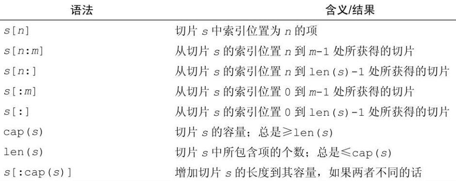

> [Go] really fells like “the C for the 21st century” – Petr Hošek

# Go 数组(array)和切片(slice)

数组是我们最常用的线性结构，比如在 python 中我们最常使用的是 list。在 Go
中提供了两种常见的线性结构：数组(array)和切片(slice)。数组就是固定长度的某种类型的序列，而切片更加灵活，它的长度是可以变化的，
所以在业务中我们最经常使用的其实还是切片。

# 数组
数组是一个包含相同类型的固定长度的序列，不像动态语言那样可以在 list 中存储不同类型的值，go 语言中数组中的类型需要一致。
我们来看一下如何创建一个数组，有这么几种形式，注意长度也是数组的一部分（不同长度的数组不是一种类型）:

```sh
声明: [length]Type
初始化：[N]Type{value1, value2,..., valueN}
省略长度：[...]Type{value1, value2,..., valueN}
二维数组: [N][M]Type
```

我们来几个小例子，不要光看代码，打开你的开发工具来编辑以下代码吧，又是一个练习手感的好机会:

```go
package main

import "fmt"

func testArray() {
	// 声明一个 int64数组，声明之后每个元素是该类型默认的『零值』
	var arrayIn64 [3]int64
	arrayIn64[0], arrayIn64[1] = 1, 2
	fmt.Println(arrayIn64)
	// 声明并且初始化
	arrayString := [3]string{"zhang", "wang", "li"}
	fmt.Println(arrayString)
	// 也可以省略长度，让 go 自动计算。这个时候你需要是使用省略号 ...
	// 创建一个长度为 3 的 float64 数组
	arrayFloat := [...]float64{1.5, 8.8, 6.6}
	fmt.Println(arrayFloat)
	// 二维数组
	matrix := [2][2]int64{
		{0, 1},
		{2, 3},
	}
	fmt.Println(matrix)
}

func main() {
	testArray()
}
```

一般对于数组的操作也就是获取长度(len函数，0到n-1)，获取指定下标的元素([index])，给数组第 i 个元素赋值等。

```go
func testArrayOperation() {
	names := [4]string{"zhang", "wang", "li", "zhao"}
	fmt.Printf("names has %d elements\n", len(names))
	fmt.Println(names[1]) // NOTE: 注意如果下标超过范围会 panic
	names[3] = "lao zhao"
	fmt.Println(names[3])
}
```

数组的示例就到这，接下来我们看下切片(slice)，其实在业务开发中切片要远比数组更加常用也更加灵活，甚至可能你都不会用到数组，
而是一直使用切片来代替。

# 切片(slice)

切片比数组更加灵活，长度是可以变化的。你可能会好奇它和数组的区别以及底层实现。实际上它和 python 的 list
比较类似，可以自动扩容。你可以简单地理解为切片是一个指向数组的指针，这个数组有它的总容量(capacity)，和目前使用使用的长度(length)。
创建一个切片我们可以使用构造方式或者内置的 make 函数。

```
// 创建一个类型为 Type, 长度为 length, 容量为 capacity 的 slice。一般我们不太关心容量而是关心长度
make([]Type, length, c capacity)
// 创建一个类型为 Type, 长度为 length 的 slice，一般我们不太关心容量，而是让 go 帮我们自动处理扩容问题
 make([]Type, length) // 最常用的一种方式
// 创建一个 Type 类型 slice
[]Type{} // 和 make([]Type, 0) 等价
// 创建并且初始化一个 slice。注意和数组的区别是 [] 里边没有省略号 ...
[]Type{value1, value2, ... , valueN}
```

以下是 slice 的常见操作，很多和数组比较类似：



同样编写一些示例代码来快速学习它，这里将使用笔者业务中最常用的一些方式:

```go
func testSlice() {
	// 创建并且初始化一个 slice
	names := []string{"zhang", "wang", "li", "zhao"}
	// 打印 names, 长度和容量
	fmt.Println(names, len(names), cap(names))
	names2 := names[0:3] // 获取子切片 0,1,2 三个元素，注意左闭右开区间
	fmt.Println(names2)
	// 尝试修改一下 names2 ，注意 names 也会跟着改变么？
	names[0] = "lao zhao"
	fmt.Println(names, names2) // 你会发现names也变了，这里起始它们共用了底层结构，注意这个问题

	// 遍历一个 slice 我们使用 for/range 语法
	for idx, name := range names { // 如果没有用到下标 idx，可以写成下划线 _ 作为占位符，但是不能省略
		fmt.Println(idx, name)
	}

	// 修改切片主要通过赋值和 append 操作。使用 append 修改切片
	vals := make([]int, 0)
	for i := 0; i < 3; i++ {
		vals = append(vals, i)
	}
	fmt.Println(vals)
	vals2 := []int{3, 4, 5}
	newVals := append(vals, vals2...) // 可以使用省略号的方式『解包』一个 slice 来连接两个 slice
	fmt.Println(newVals)
}
```

# 如何给一个切片排序？

切片操作和 python list 比较类似，但是也要注意一些区别。比如子切片和原切片共享底层结构，如果需要深拷贝你得自己去复制一个新的。
另外 go 只支持正数的索引，你需要保证 slice 索引值必须要在 0 到 length-1，否则会出现 panic 导致程序退出。

这里介绍一下如何来排序和搜索一个 slice，除了自己写排序算法之外，标准库提供了 sort 包来帮助我们处理排序问题。
常用的有几个函数，go 标准库文档已经有非常好的示例（好好学英语啊）：

```go
sort.Ints(a []int) // Ints sorts a slice of ints in increasing order.
sort.Float64s(a []float64) // Float64s sorts a slice of float64s in increasing order (not-a-number values are treated as less than other values).
sort.Search(n int, f func(int) bool) int // Search uses binary search to find and return the smallest index i in [0, n) at which f(i) is true
```

# 小练习

- 请给一个 slice 反向排序？不知道的话请搜索 go 的 sort 文档
- 什么情况下我们要去关心 slice 的容量呢？append 之后它的容量如何变化呢？
- sort 包里的稳定排序和非稳定排序有什么区别？
